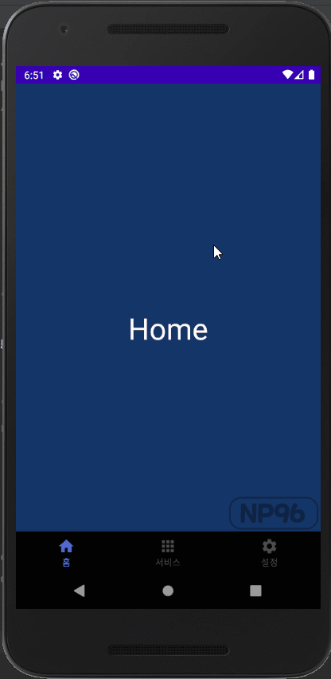

# Topic

<pre>

1. com.google.android.material.bottomnavigation.BottomNavigationView 사용

2. menu 생성 후 연결

* app:itemRippleColor = 클릭 시 발생하는 이벤트의 색깔
* app:backgroundTint = Navigarion 백그라운드 색상
* app:itemTextColor = Navigation 텍스트 색상
* app:itemIconTint = Navigation 아이콘 색상

</pre>

  

# Preview

