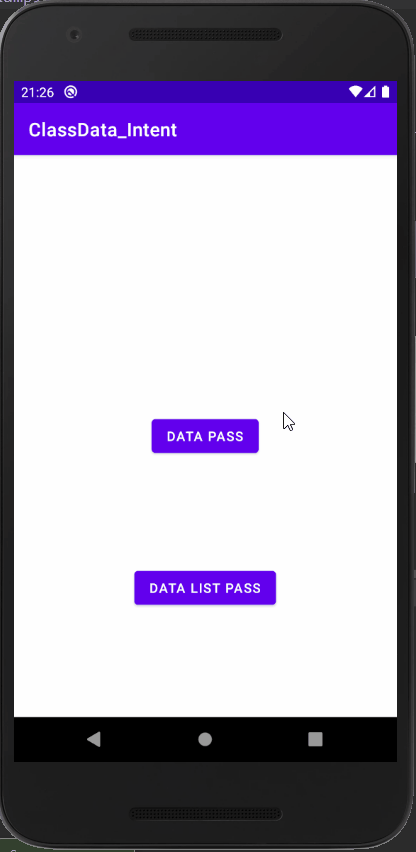

# Topic

<pre>

1. Class 객체를 Intent에 넣어서 보낸다.

2. 전송할 Class를 @Parcelize 사용하여 선언하였다.

3. 1개를 받을 때는 getParcelableExtra를 사용한다

4. 다수가 포함 된 리스트를 받을 때는 getSerializableExtra를 사용한다.

</pre>

  

# Preview

