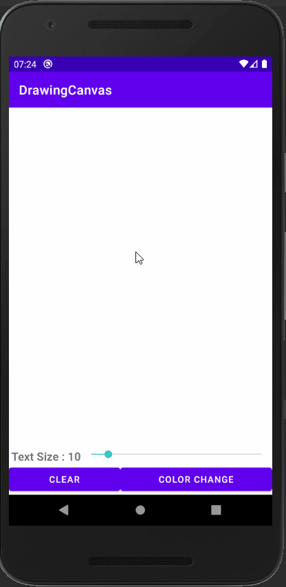

# Topic

<pre>

1. Drawing Canvas 

2. Text Size Change 기능, Clear 기능, Color Change 기능

3. 현재는 하나의 path를 사용하므로 Color, TextSize를 변경할 경우 이전 것도 같이 변해버린다.

4. 3번의 문제를 해결하기 위해서는 각 path를 따로 저장하여야 한다. 그러면 되돌리기와 같은 기능또한 구현해낼 수 있다.

</pre>

  

# Preview

