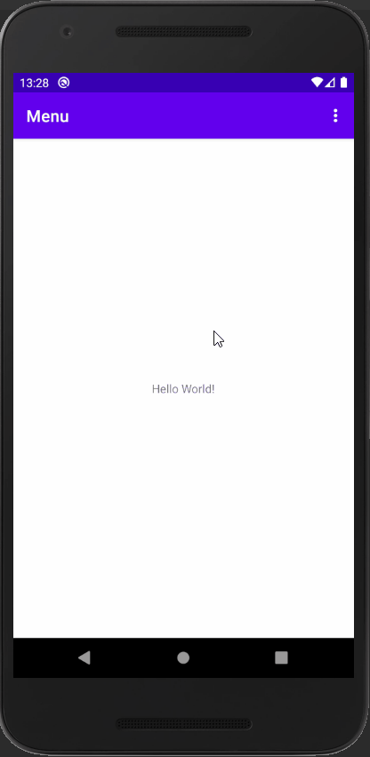

# Topic

<pre>

1. Menu 디렉터리 생성 후 menu.xml 파일 생성

2. 메뉴의 각 아이템을 선택하였을 시 다른 값을 전달하고, 이를 표시하므로 확인

3. Manifest 파일의 android:parentActivityName=".MainActivity" 을 추가하여 뒤로가기 버튼 생성

</pre>

  

# Preview

