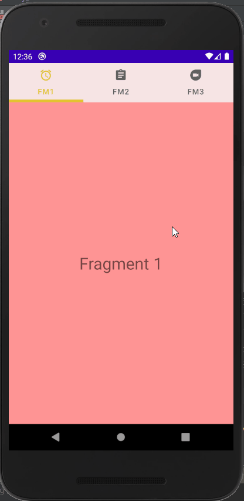
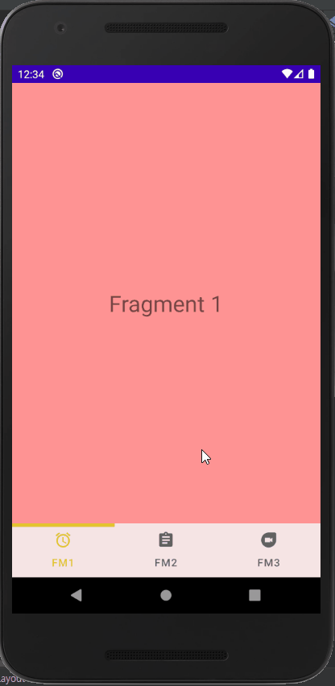

# Topic

<pre>
<h2>Swife View 생성</h2>

1. TableLayout과 ViewPager2 사용
2. Selected Tab Icon Color and Text Color Change - 선택된 탭의 아이콘, 텍스트 컬러 변경

3. Tab Bar Top or Bottom - 탭(네비) 바 위치 위쪽 혹은 아래쪽 배치
=> 위쪽에 위치하게 하기 위해서는 TabLayout -> ViewPager2 순으로 레이아웃 구성
=> 아래쪽에 위치하게 하기 위해서는 ViewPager2 -> TabLayout 순으로 레이아웃 구성

</pre>

  

# Preview

  

