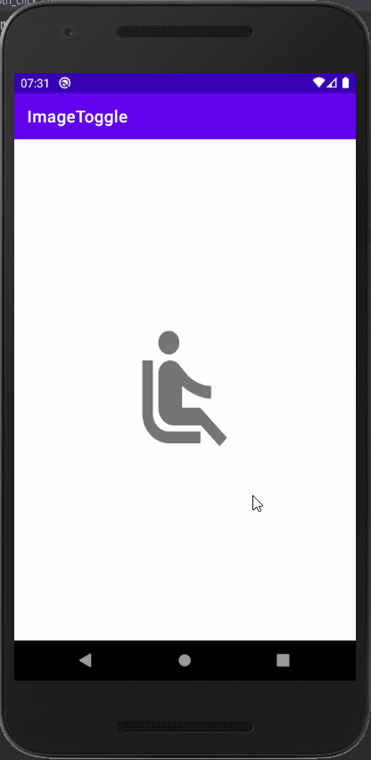

# Topic

1. Toggle Button

2. 변경할 Image는 Drawable 파일의 btn_click_event.xml 파일에서 변경해준다.

ㄴ state_checked 를 사용함으로써 toggle 때마다 다른 이미지를 보여줄 수 있다.

※ Toggle 시 직접 값(True/False)을 변경해주어야 한다.

  

# Preview

