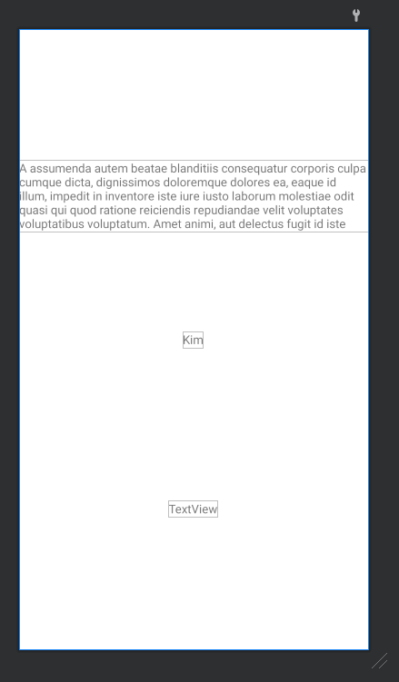
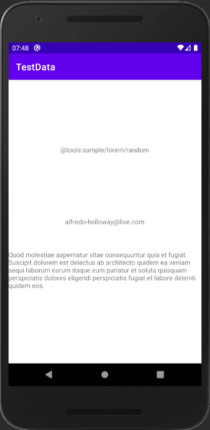

# Topic

- layout random Text

1. "@tools:sample/*" 리소스  
ㄴ https://developer.android.com/studio/write/tool-attributes#toolssample_resources

2. Sample Data Create  
Text 뿐만 아니라 16진수 Color 값이나 이미지를 넣어서 불러올 수 있다.

ㄴ app -> New -> Sample Data Directory  
ㄴ sampledata -> New -> File  
(sampledata 디렉터리 안보일 경우 Android에서 Project로 변경)
  

<b>※ Layout 상에서 배치와 비율 같은 것을 테스트하기 위해서 사용하는 것이므로 실제로 실행하였을 경우 적용되지 않으며 에러가 발생할 수도 있다.
이미지1을 보면 레이아웃 미리보기에서는 표시가 되지만 실제 실행된 이미지2에서는 '@tool...' 텍스트가 그대로 보여진다.</b>
 
 

- Lorem(random Text)  
https://github.com/Qase/LoremKotlinum

 사용방법 
1. build(Module) - allprojects - repositories에 :  maven { url 'https://jitpack.io' } 추가   
2. build(Project) - dependencies에 : implementation 'com.github.Qase:LoremKotlinum:1.0' 추가   
3. Lorem 안에 있는 메소드 호출하여 사용

  

# Preview

 

